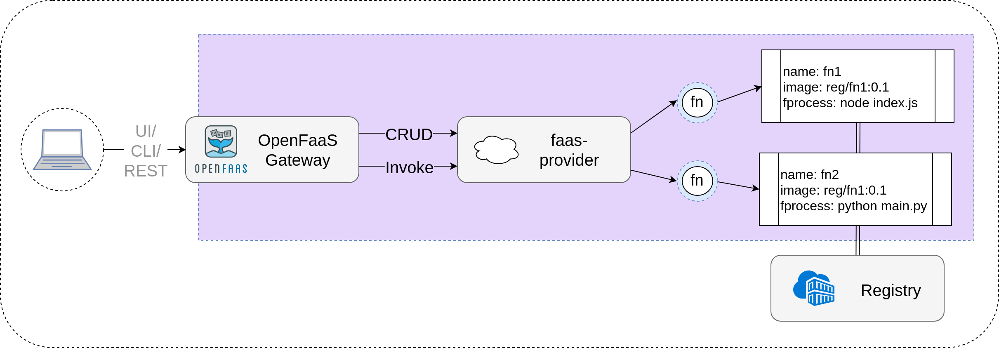

faas-provider
==============

This faas-provider can be used to write your own back-end for OpenFaaS. The Golang SDK can be vendored into your project so that you can provide a provider which is compliant and compatible with the OpenFaaS gateway.



The faas-provider provides CRUD for functions and an invoke capability. If you complete the required endpoints then you will be able to use your container orchestrator or back-end system with the existing OpenFaaS ecosystem and tooling.

> See also: [backends guide](https://github.com/openfaas/faas/blob/master/guide/deprecated/backends.md)

### Recommendations

The following is used in OpenFaaS and recommended for those seeking to build their own back-ends:

* License: MIT
* Language: Golang

### How to use this project

All the required HTTP routes are configured automatically including a HTTP server on port 8080. Your task is to implement the supplied HTTP handler functions.

For an example see the [server.go](https://github.com/openfaas/faas-netes/blob/master/server.go) file in the [faas-netes](https://github.com/openfaas/faas-netes) Kubernetes backend.

I.e.:

```go
	timeout := 8 * time.Second
	bootstrapHandlers := bootTypes.FaaSHandlers{
		FunctionProxy:  handlers.MakeProxy(),
		DeleteHandler:  handlers.MakeDeleteHandler(clientset),
		DeployHandler:  handlers.MakeDeployHandler(clientset),
		FunctionReader: handlers.MakeFunctionReader(clientset),
		ReplicaReader:  handlers.MakeReplicaReader(clientset),
		ReplicaUpdater: handlers.MakeReplicaUpdater(clientset),
		InfoHandler:    handlers.MakeInfoHandler(),
		LogHandler: logs.NewLogHandlerFunc(requestor,timeout),
	}

	var port int
	port = 8080
	bootstrapConfig := bootTypes.FaaSConfig{
		ReadTimeout:  timeout,
		WriteTimeout: timeout,
		TCPPort:      &port,
	}

	bootstrap.Serve(&bootstrapHandlers, &bootstrapConfig)
```

### Need help?

Join `#faas-provider` on [OpenFaaS Slack](https://docs.openfaas.com/community/)
