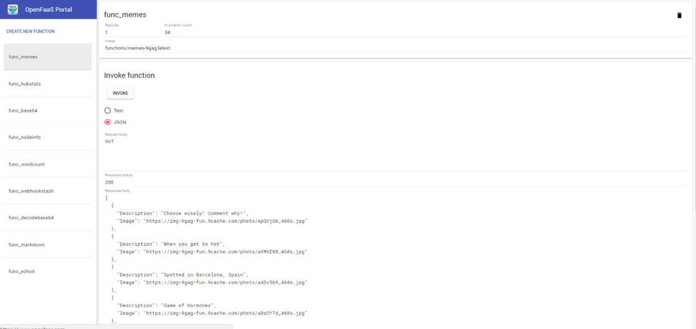

## functions/memes-9gag

Use this FaaS function to get the latest 9Gag memes.

**Build the memes-9gag function**

```
$ faas-cli build -f ./stack.yml
```

**Deploy the memes-9gag function**

Note:
If pushing to a remote registry change the name from `mlabouardy` to your own Hub account.

```
$ faas-cli push -f ./stack.yml
$ faas-cli deploy -f ./stack.yml
```

Then invoke via `curl`, `faas-cli` or the UI.


